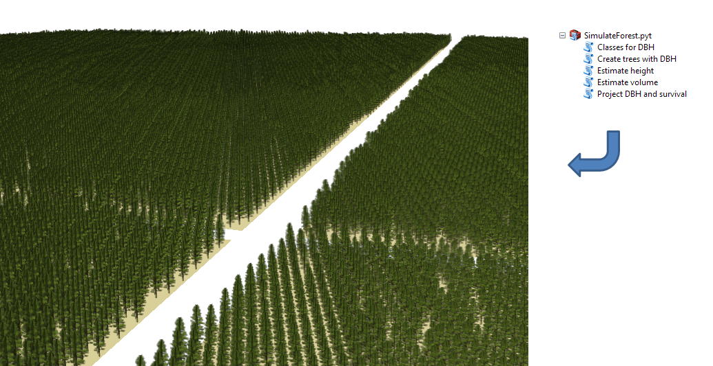
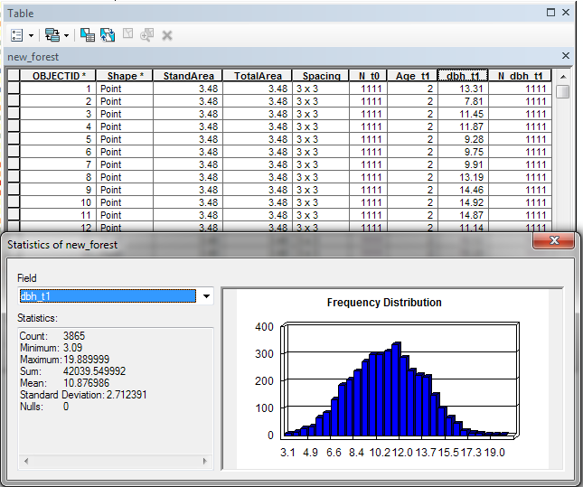
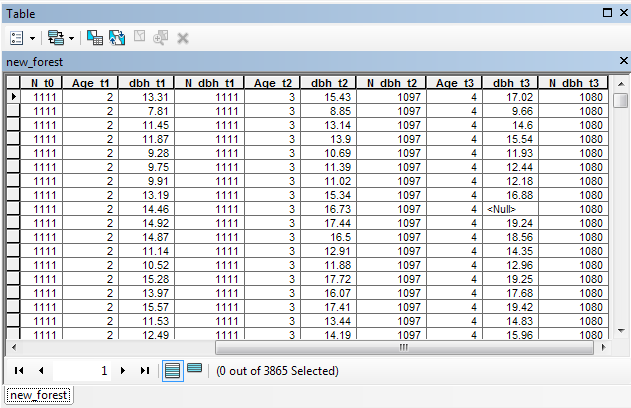

# Simulate Forest
Several studies in forest science rely on a database that contains the dimensions 
of trees from a forest over the years. There are cases where real observed data 
is not required and the characteristics of the forests can be obtained by
simulation.

The SimulateForest.pyt script is a Python Toolbox containing 5 tools that work 
on ArcGIS 10.3. They aim to create a group of points that represent trees of an 
even-aged forest, with attribute tables containing DBH, height, and volume values.

A complete document about the Toolbox is published (in Portuguese) here: 
[Simulation of even-aged forests](http://www.locus.ufv.br/bitstream/handle/123456789/9896/texto%20completo.pdf)

\
*Toolbox overview and an example of a simulated forest in ArcScene.*
   

### Table of Contents
[**Introduction**](#introduction) 
[**Tool #1:** Create trees with DBH](#tool-1-create-trees-with-dbh) 
[**Tool #2:** Project DBH and survival](#tool-2-project-dbh-and-survival) 
[**Tool #3:** Estimate height](#tool-3-estimate-height) 
[**Tool #4:** Estimate volume](#tool-4-estimate-volume) 
[**Tool #5:** Classes for DBH](#tool-5-classes-for-dbh) 
 

## Introduction
A Python Toolbox is a group of ArcGIS tools that execute a piece of code to perform 
tasks in geographic data. It is coded in Python 2.7 and works as it is. From ArcMap 
or ArcCatalog just navigate to the file directory and a toolbox should be shown.

The values for the inputs on each tool, provided as default, are an example of 
use. They result in a simulated forest containing trees with attributes close 
to what is seen in 
[Demolinari (2006)](https://www.locus.ufv.br/bitstream/handle/123456789/3052/texto%20completo.pdf)
 and 
[Demolinari et al. (2007)](http://dx.doi.org/10.1590/S0100-67622007000300016)

The “(optional)” seen after the names of some inputs do not always indicate that 
the input is optional. This inconsistency happens because it is not allowed to 
set an input as required or optional based on the value of another input.
  

## Tool #1: Create trees with DBH
This tool creates a mesh of points (representing trees) based on a surface and 
spacing values. It also creates DBH (tree diameter at 1.3 m from the ground) 
values for these points based on a probability distribution.

It takes a spatial feature (file that represents geographic data in ArcMAP) of 
the polygon type as input, representing the stand(s) where the trees are going 
to be created. In order to create the DBH values, the user must select a diameter 
distribution type: Normal, Gamma or Weibull. The user must also specify for what 
age the diameters are being created.

The allocation of the DBH values for each point is driven by the cell values of 
a reference raster. This raster is generated based on a set of points containing 
random DBH values and separated by a minimum distance. The number of points and 
the minimum distance are defined by the user. The higher the number of points 
and the lower the minimum distance, the greater the randomness in the allocation 
of diameters. The user also provides an index from 0 to 1 that causes a disturbance 
in the values of the raster cells, aiming to give some heterogeneity to the 
allocation process.

Finally, the percentage of surviving trees is determined. A number of points is 
randomly selected according to the % value provided by the user, and their diameter 
fields are left empty (null). If the file to be saved does not allow fields to 
be null, DBH is set to zero.
  

\
*Tool #1 interface with example inputs.*
  

\
*Point feature resulted from Tool #1.*
  

\
*Attribute table of the point feature resulted from Tool #1.*
  

## Tool #2: Project DBH and survival
This tool projects the DBH from an early age to a future age. It is applied to 
values of an attribute table belonging to a point-type spatial feature (representing 
trees). The tool uses difference equations obtained from the Schumacher (1), 
Lundqvist-Korf (2) and Richards (3) models:

where *dbh*1 is the diameter at 1,3 m at presente age, in cm; 
*dbh*2 is the diameter at 1,3 m at future age, in cm; *A*1 
is the current current age, in years; *A*2 is the future age, in years; 
*β*i are the model parameters; and *ε* is the random error, where 
*ε* ~ *N*(0, *σ*2).

After selecting the model, the user must provide its parameters for the 
calculations. Then, the fields of the point feature that have the initial values 
for age and DBH must be selected. It is worth mentioning that the initial diameter 
and age values come from these fields, while the projection times are provided 
directly by the user.

The field “Time at first projection” is used to define the first projection in 
relation to the initial values of DBH and age. The user then specifies the time 
(years) to the end of projections and the time interval between each projection. 
For example, if the initial age is two years, the time until the end of the 
projections is six years and the interval between them is two years, the 
projections are made for the ages of four, six and eight years.

A heterogeneity index between 0 and 1 was added to the tool, so that the rate 
that projects the DBH (calculated by the model) is not exactly the same for all 
trees. The projection rate is recalculated, based on the index, to a random value 
of a Normal distribution with the original rate as average. The closer the index 
is to 1, the greater the heterogeneity.

The second feature of this tool is survival projection. Survival projection can 
be based on two criteria: use of Pienaar and Shiver model or percentage. In the 
first case, the applied model is:

where *N*1 is the number of trees per hectare at initial age; 
*N*2 is the number of trees per hectare at final age; *A*1 
is the current age, in years; *A*2 is the future age, in years; 
*β*i are the model parameters; and *ε* is the random error, where 
*ε* ~ *N*(0, *σ*2).

In case of survival projection by percentage, a logarithmic model is fitted so 
the result of *N*2 corresponds exactly to the intended reduction of 
the number of living trees in relation to *N*1.

Dead trees are randomly selected. The DBH fields of these trees are left empty 
(null). If the file to be saved does not allow fields to be null, DBH is set to 
zero.
  

\
*Tool #2 interface with example inputs.*
  

\
*Attribute table of the point feature after applying Tool #2.*
  

## Tool #3: Estimate height
This tool estimates the height of living trees represented in a point-like 
spatial feature. It creates a field for height in the attribute table and uses 
models that are function of DBH or DBH &ast; age. The user must choose between 
Schumacher (1), Lundqvist-Korf (2), Gompertz (3) or Weibull (4) models:

where *Ht* is the total height, in m; *X* is the model independent variable, 
which can be DBH or DBH &ast; age, in cm and m; *β*i are the model 
parameters; and *ε* is the random error, where *ε* ~ *N*(0, *σ*2).

After selecting the model, the user must provide its parameters. Next, the user 
must select the DBH and age fields (or just DBH, depending on the independent 
variable chosen) for which he wants to estimate height.

A heterogeneity index ranging from 0 to 1 was added to the Estimate Height tool. 
It allows different heights to be calculated for trees of same DBH and age, but 
preserving the overall mean of heights. The closer the index is to 1, the greater 
the heterogeneity.
  

\
*Tool #3 interface with example inputs.*
  

\
*Attribute table of the point feature after applying Tool #3.*
  

## Tool #4: Estimate volume
This tool estimates the volume of living trees represented in a point-like 
spatial feature. To do so, the user can choose between using a form factor or 
the Schumacher and Hall model:

where *V* is the volume, in m3; *DBH* is the diameter at 1,3 m, in cm; *Ht* is 
the total height, in m; *β*i are the model parameters; and *ε* is 
the random error, where *ε* ~ *N*(0, *σ*2).

After selecting which method to use for the estimates, the user must provide 
the form factor or model parameters for the calculations. Then, if he has chosen 
to use the Schumacher and Hall model, he must select the DBH and Ht fields for 
which he wants to estimate the volume.
  

\
*Tool #4 interface with example inputs.*
  

\
*Attribute table of the point feature after applying Tool #4.*
  

## Tool #5: Classes for DBH
This tool calculates the center of the diameter class to which the DBH values 
of an attribute table field belong.

The user must define the size of the class range and (optionally) the minimum 
DBH value to consider when creating the classes. If the minimum value is not 
given, it will be equal to the smallest DBH found in the attribute table.
  

\
*Tool #5 interface with example inputs.*
  

\
*Attribute table of the point feature after applying Tool #4.*
  
